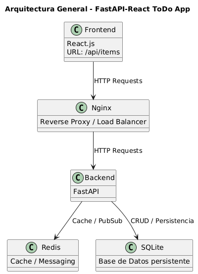
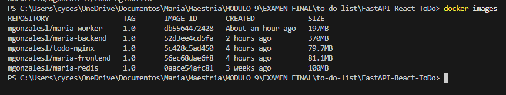
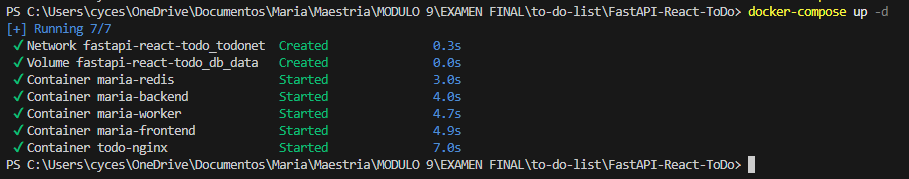

# FastAPI-React ToDo App

## 1. Descripción de la aplicación

Esta aplicación es un **sistema de lista de tareas (To-Do List)** desarrollado originalmente por [TenSzalik](https://github.com/TenSzalik/FastAPI-React-ToDo) y adaptada para el **examen final del módulo TJA / MIST-1-1-V-2025 / MIS-709: Containerization and Container Orchestration** (Par. 1).

La app utiliza la siguiente arquitectura tecnológica:

- **Frontend:** React
- **Backend/API:** FastAPI (Python)
- **Base de datos:** SQLite (persistente)
- **Cache / Messaging:** Redis
- **Reverse Proxy / Load Balancer:** Nginx

Funcionalidades principales:

- Crear, listar, actualizar y eliminar tareas.
- Comunicación eficiente entre frontend y backend vía API REST.
- Persistencia de datos y cacheo con Redis.
- Despliegue en contenedores Docker y orquestación con **Docker Swarm** y **Kubernetes**.

> Esta versión ha sido adaptada para cumplir los requerimientos del examen final de contenedorización y orquestación, incluyendo la creación de Dockerfiles optimizados, Docker Compose, Swarm Stack y manifiestos de Kubernetes.

---

## 2. Arquitectura general

### **Diagrama de servicios (ASCII)**



- Todos los servicios se conectan a través de **una red personalizada de Docker (`todonet`)**.
- La base de datos SQLite se monta en un **volumen persistente**.
- Nginx sirve como **reverse proxy** para exponer el frontend y balancear carga.

---

## 3. Instrucciones paso a paso

### **3.1 Despliegue local con Docker Compose**
Descargar imagenes desde DockerHub
```bash
docker-compose build
docker pull mgonzalesl/maria-backend:1.0
docker pull mgonzalesl/maria-frontend:1.0
docker pull mgonzalesl/maria-redis:1.0
docker pull mgonzalesl/maria-worker:1.0
docker pull mgonzalesl/todo-nginx:1.0

docker images
```


1. Construir los servicios:
```bash
docker-compose build
```

2. Levantar los servicios: 
```bash
docker-compose up -d
```

3.Verificar servicios corriendo:
```bash
docker ps
```



4. Acceder al frontend en el navegador:

http://localhost:3000 (puerto configurado en .env)

5. Probar API:
```bash
curl http://localhost:3000/api/items/
```

### **3.2 Despliegue en Docker Swarm**
1. Inicializar Swarm:
```bash
docker swarm init
```

2. Construir imágenes y etiquetarlas (si no están):
```bash
docker build -t mgonzalesl/maria-backend:1.0 ./backend
docker build -t mgonzalesl/maria-frontend:1.0 ./frontend
docker build -t mgonzalesl/todo-nginx:1.0 ./nginx
```

3. Crear secrets si aplica:
```bash
echo "myRedisPassword123" | docker secret create redis_password -
echo "myDBPassword123" | docker secret create db_password -
```

4. esplegar el stack:
```bash
docker stack deploy -c stack-deploy.yml todo-stack
```

5. Verificar servicios:
```bash
docker stack services todo-stack
docker service ls
```

6. Ver logs de un servicio:
```bash
docker service logs todo-stack_backend
```

### **3.3 Despliegue en Kubernetes**

1. Aplicar manifiestos:
```bash
kubectl apply -f k8s/
```

2. Verificar Pods y Services:
```bash
kubectl get pods
kubectl get services
```

3. Acceder al frontend:

Usar la IP de servicio de tipo LoadBalancer o kubectl port-forward:
```bash
kubectl port-forward svc/frontend 8080:80
```
### **4. Capturas de pantalla y salidas de verificación**
Ejemplo Docker Compose
```bash
$ docker ps
CONTAINER ID   IMAGE                     STATUS         PORTS
abcd1234       maria-backend:1.0        Up 2m          0.0.0.0:8000->8000/tcp
efgh5678       maria-frontend:1.0       Up 2m          0.0.0.0:3000->80/tcp
ijkl9012       todo-nginx:1.0           Up 2m          0.0.0.0:8080->80/tcp
mnop3456       redis:alpine             Up 2m          0.0.0.0:6379->6379/tcp
```

Ejemplo Docker Swarm
```bash
$ docker stack services todo-stack
ID            NAME                 MODE        REPLICAS  IMAGE
abcd12        todo-stack_backend   replicated  2/2       maria-backend:1.0
efgh34        todo-stack_frontend  replicated  2/2       maria-frontend:1.0
ijkl56        todo-stack_nginx     replicated  2/2       todo-nginx:1.0
mnop78        todo-stack_redis     replicated  1/1       redis:alpine
```

Ejemplo API
```bash
curl http://localhost:3000/api/items/
# [
#   {"id":1, "title":"Estudiar Docker", "completed":false},
#   {"id":2, "title":"Preparar examen", "completed":true}
# ]
```
