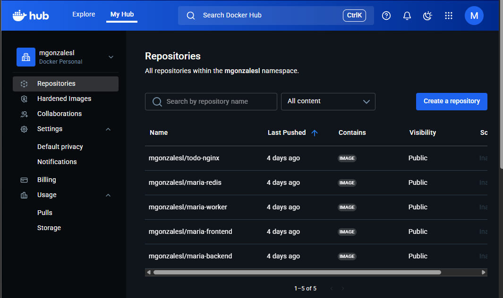
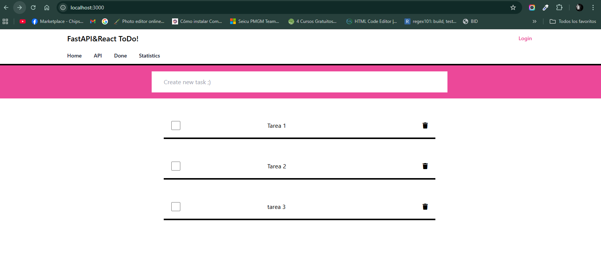
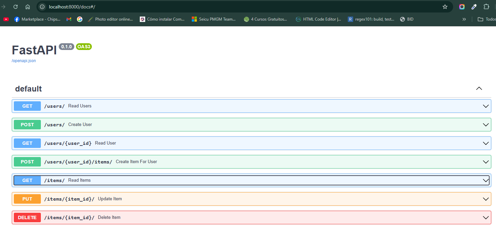
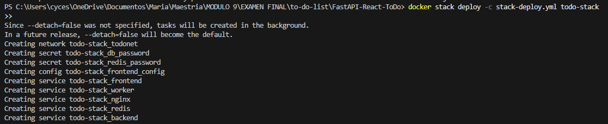
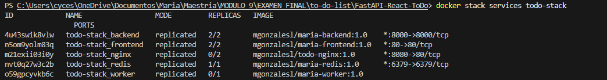

# FastAPI-React ToDo App

## 1. Descripción de la aplicación

Esta aplicación es un **sistema de lista de tareas (To-Do List)** desarrollado originalmente por [TenSzalik](https://github.com/TenSzalik/FastAPI-React-ToDo) y adaptada para el **examen final del módulo TJA / MIST-1-1-V-2025 / MIS-709: Containerization and Container Orchestration** (Par. 1).

La app utiliza la siguiente arquitectura tecnológica:

- **Frontend:** React
- **Backend/API:** FastAPI (Python)
- **Base de datos:** SQLite (persistente)
- **Cache / Messaging:** Redis
- **Reverse Proxy / Load Balancer:** Nginx

Funcionalidades principales:

- Crear, listar, actualizar y eliminar tareas.
- Comunicación eficiente entre frontend y backend vía API REST.
- Persistencia de datos y cacheo con Redis.
- Despliegue en contenedores Docker y orquestación con **Docker Swarm** y **Kubernetes**.

> Esta versión ha sido adaptada para cumplir los requerimientos del examen final de contenedorización y orquestación, incluyendo la creación de Dockerfiles optimizados, Docker Compose, Swarm Stack y manifiestos de Kubernetes.

---

## 2. Arquitectura general

### **Diagrama de servicios (ASCII)**


- Todos los servicios se conectan a través de **una red personalizada de Docker (`todonet`)**.
- La base de datos SQLite se monta en un **volumen persistente**.
- Nginx sirve como **reverse proxy** para exponer el frontend y balancear carga.

---

### **Estructura del proyecto**
Este proyecto implementa una aplicación de lista de tareas (To-Do List) con arquitectura cliente-servidor y despliegue mediante contenedores Docker.
La solución integra varios servicios coordinados con Docker Compose y Docker Swarm para garantizar modularidad, escalabilidad y fácil despliegue.
```bash
to-do-list/
│
├── Backend/                  # API REST desarrollada con FastAPI
│   ├── __pycache__/          # Archivos temporales compilados de Python
│   ├── Dockerfile            # Imagen Docker del backend
│   ├── crud.py               # Operaciones CRUD sobre la base de datos
│   ├── database.py           # Configuración de la base de datos (SQLAlchemy)
│   ├── main.py               # Punto de entrada principal del backend (app FastAPI)
│   ├── models.py             # Modelos ORM que representan las tablas SQL
│   ├── requirements.txt      # Dependencias del backend
│   ├── schemas.py            # Esquemas Pydantic para validación de datos
│   └── sql_app.db            # Base de datos SQLite (modo local / pruebas)
│
├── db/                       # Directorio reservado para base de datos (volúmenes o inicialización)
│
├── frontend/                 # Aplicación del lado del cliente (React + Tailwind)
│   ├── public/               # Archivos estáticos públicos (index.html, íconos, etc.)
│   ├── src/                  # Código fuente React (componentes, rutas, servicios)
│   ├── Dockerfile            # Imagen Docker del frontend
│   ├── nginx.conf            # Configuración Nginx para servir la app en producción
│   ├── package.json          # Dependencias y scripts de npm/yarn
│   ├── package-lock.json     # Bloqueo de versiones npm
│   ├── postcss.config.js     # Configuración de PostCSS
│   ├── tailwind.config.js    # Configuración de Tailwind CSS
│   └── yarn.lock             # Bloqueo de dependencias para Yarn
│
├── nginx/                    # Configuración del proxy reverso
│   ├── Dockerfile            # Imagen Docker para Nginx
│   ├── default.conf          # Configuración de sitios (reverse proxy frontend/backend)
│   └── nginx.conf            # Configuración general del servidor Nginx
│
├── redis/                    # Servicio de caché y cola de tareas
│   └── Dockerfile            # Imagen Docker para Redis (personalizada o extendida)
│
├── secrets/                  # Archivos de credenciales sensibles
│   ├── db_password.txt       # Contraseña de la base de datos
│   └── redis_password.txt    # Contraseña del servicio Redis
│
├── worker/                   # Servicio para tareas en segundo plano
│   ├── Dockerfile            # Imagen Docker para el worker
│   └── requirements.txt      # Dependencias del worker (ej. Celery, Redis, etc.)
│
├── .dockerignore             # Archivos que Docker debe ignorar durante la construcción
├── .env                      # Variables de entorno (puertos, contraseñas, etc.)
├── docker-compose.yml        # Orquestación de servicios en entorno local
├── stack-deploy.yml          # Archivo de despliegue para Docker Swarm (modo producción)
└── README.md                 # Documentación del proyecto
```
### **Flujo General del Sistema**
Frontend (React) → solicita datos (tareas, usuarios) al Backend (FastAPI).
Backend (FastAPI) → consulta la Base de Datos (SQLite/PostgreSQL).
Redis → almacena caché o envía tareas al Worker.
Worker → ejecuta procesos pesados o asíncronos (en segundo plano).
Nginx → sirve la aplicación React y redirige las solicitudes al backend.

### **Archivos de Docker**
Estos archivos permiten crear imágenes y ejecutar contenedores de cada componente del sistema.

| Archivo                | Ubicación   | Descripción                          |
|-------------------------|-------------|--------------------------------------|
| `backend/Dockerfile`    | `backend/`  | Define la imagen del API FastAPI     |
| `frontend/Dockerfile`   | `frontend/` | Define la imagen del frontend React  |
| `nginx/Dockerfile`      | `nginx/`    | Crea el contenedor proxy inverso     |
| `redis/Dockerfile`      | `redis/`    | Imagen personalizada de Redis        |
| `worker/Dockerfile`     | `worker/`   | Define el servicio de tareas asíncronas |
| `.dockerignore`         | `raíz`      | Archivos que no deben incluirse en las imágenes |

### **Archivos de Docker Swarm**
Docker Swarm es la capa de orquestación de contenedores en clúster,
y sus archivos principales también están en la raíz del proyecto.

| Ubicación | Archivo | Rol |
|------------|----------|-----|
| `stack-deploy.yml` | Swarm Stack | Archivo principal de despliegue en Swarm. Define todos los servicios, redes, volúmenes y políticas de réplica. |
| `.env` | Variables globales | Provee configuraciones y contraseñas que Swarm inyecta a los servicios definidos en `stack-deploy.yml`. |
| `secrets/db_password.txt`<br>`secrets/redis_password.txt` | Secretos de Swarm | Archivos utilizados como **Docker secrets** para proteger contraseñas en producción. |
| `docker-compose.yml` | Base del Stack | Puede reutilizarse para Swarm con el comando:<br>`docker stack deploy -c docker-compose.yml <nombre>`. |

### **Kubernetes (K8s)**
Para despliegues en Kubernetes se recomienda crear los siguientes archivos (no incluidos en el repositorio por defecto):
| Archivo sugerido | Descripción |
|------------------|-------------|
| `k8s/backend-deployment.yml` | Deployment y Service del backend |
| `k8s/frontend-deployment.yml` | Deployment y Service del frontend |
| `k8s/redis-deployment.yml` | Redis con PVC |
| `k8s/worker-deployment.yml` | Worker con cola de tareas |
| `k8s/nginx-ingress.yml` | Ingress Controller para el tráfico HTTP/HTTPS |

## 3. Instrucciones paso a paso

### **3.1 Despliegue local con Docker Compose**

Descargar imagenes desde DockerHub
```bash
docker-compose build
docker pull mgonzalesl/maria-backend:1.0
docker pull mgonzalesl/maria-frontend:1.0
docker pull mgonzalesl/maria-redis:1.0
docker pull mgonzalesl/maria-worker:1.0
docker pull mgonzalesl/todo-nginx:1.0

docker images
```


1. Construir los servicios:
```bash
docker-compose build
```

2. Levantar los servicios: 
```bash
docker-compose up -d
```

3.Verificar servicios corriendo:
```bash
docker ps
```


4. Acceder al frontend en el navegador:

http://localhost:3000 (puerto configurado en .env)



5. Probar API:
   
curl http://localhost:3000/api/docs



### **3.2 Despliegue en Docker Swarm**
Archivo stack-deploy.yml para Swarm

```bash
# stack-deploy.yml
version: "3.9"

services:
  redis:
    image: mgonzalesl/maria-redis:1.0
    # no publish de puerto es recomendado en swarm para servicios internos
    ports:
      - "6379:6379"   # opcional: publica Redis al host (si lo necesitas)
    networks:
      - todonet
    deploy:
      replicas: 1
      restart_policy:
        condition: on-failure
    healthcheck:
      test: ["CMD", "redis-cli", "ping"]
      interval: 5s
      timeout: 2s
      retries: 5
    secrets:
      - redis_password

  backend:
    image: mgonzalesl/maria-backend:1.0
    ports:
      - "8000:8000"
    volumes:
      - db_data:/app/db
    env_file:
      - .env
    environment:
      - REDIS_URL=redis:6379
      - REDIS_PASSWORD_FILE=/run/secrets/redis_password
    networks:
      - todonet
    deploy:
      replicas: 2
      restart_policy:
        condition: on-failure
    command: ["/bin/sh", "-c", "while ! nc -z redis 6379; do sleep 1; done && uvicorn main:app --host 0.0.0.0 --port 8000"]
    secrets:
      - redis_password
      - db_password

  frontend:
    image: mgonzalesl/maria-frontend:1.0
    ports:
      - "80:80"
    networks:
      - todonet
    deploy:
      replicas: 2
      restart_policy:
        condition: on-failure
    configs:
      - source: frontend_config
        target: /app/config.js

  worker:
    image: mgonzalesl/maria-worker:1.0
    networks:
      - todonet
    deploy:
      replicas: 1
      restart_policy:
        condition: on-failure
    depends_on:
      - backend
      - redis
    secrets:
      - redis_password

  nginx:
    image: mgonzalesl/todo-nginx:1.0
    ports:
      - "8080:80"
    volumes:
      - ./nginx/default.conf:/etc/nginx/conf.d/default.conf:ro
    networks:
      - todonet
    deploy:
      replicas: 2
      restart_policy:
        condition: on-failure

volumes:
  db_data:

networks:
  todonet:

secrets:
  redis_password:
    file: ./secrets/redis_password.txt
  db_password:
    file: ./secrets/db_password.txt

configs:
  frontend_config:
    file: ./frontend/config.js
```

El archivo incluye:
- Uso de imágenes con tags :1.0 (versionamiento).
- Réplicas en deploy.replicas para escalabilidad.
- secrets y configs apuntan a archivos locales que deben existir antes de docker stack deploy.
- container_name y build: no están presentes (no son válidos en stack).

1. Crear archivos 
```bash
./secrets/redis_password.txt
./secrets/db_password.txt
./frontend/config.js
.env 
```
2. Crear los archivos de secrets
```bash
mkdir secrets

# Crear secretos
"myRedisPassword123" | Out-File -Encoding ascii .\secrets\redis_password.txt
"myDBPassword123"    | Out-File -Encoding ascii .\secrets\db_password.txt

# Crear config.js mínimo para frontend
'window.__CONFIG__ = { API_URL: "http://maria-backend:8000/api" };' > .\frontend\config.js
```
3. Construir y subir las imágenes
```bash
# build local (si aún no existen)
docker build -t mgonzalesl/maria-backend:1.0 ./backend
docker build -t mgonzalesl/maria-frontend:1.0 ./frontend
docker build -t mgonzalesl/maria-worker:1.0 ./worker    
docker build -t mgonzalesl/maria-redis:1.0 ./redis      
docker build -t mgonzalesl/todo-nginx:1.0 ./nginx

docker push mgonzalesl/maria-backend:1.0
docker push mgonzalesl/maria-frontend:1.0
docker push mgonzalesl/maria-worker:1.0
docker push mgonzalesl/maria-redis:1.0
docker push mgonzalesl/todo-nginx:1.0
```
4. Inicializar Swarm:
```bash
docker swarm init
```
5. Desplegar el stack
```bash
docker stack deploy -c stack-deploy.yml todo-stack
```


6. Verificar el despliegue
```bash
# ver servicios del stack
docker stack services todo-stack

# ver tareas / containers
docker stack ps todo-stack

# ver logs de un servicio
docker service logs todo-stack_backend --follow

# ver secretos creados en Swarm
docker secret ls

# inspeccionar config creada
docker config ls
```
Resultado de *docker stack services todo-stack*


### **3.3 Despliegue en Kubernetes**

1. Aplicar manifiestos:
```bash
kubectl apply -f namespace.yaml
kubectl apply -f secret.yaml
kubectl apply -f redis-deployment.yaml
kubectl apply -f backend-deployment.yaml
kubectl apply -f frontend-deployment.yaml
kubectl apply -f worker-deployment.yaml
kubectl apply -f nginx-deployment.yaml
```

2. Verificar Pods y Services:
```bash
kubectl get pods -n todo-app
kubectl get svc -n todo-app
kubectl rollout status deployment/backend -n todo-app
```

4. Acceder al frontend:

Usar la IP de servicio de tipo LoadBalancer o kubectl port-forward:
```bash
kubectl port-forward svc/frontend 8080:80
```

4. Versionamiento
```bash
docker build -t mgonzalesl/maria-backend:2.0 ./backend
docker push mgonzalesl/maria-backend:2.0
```

### **4. Salidas de verificación**
Ejemplo Docker Compose
```bash
$ docker ps
CONTAINER ID   IMAGE                     STATUS         PORTS
abcd1234       maria-backend:1.0        Up 2m          0.0.0.0:8000->8000/tcp
efgh5678       maria-frontend:1.0       Up 2m          0.0.0.0:3000->80/tcp
ijkl9012       todo-nginx:1.0           Up 2m          0.0.0.0:8080->80/tcp
mnop3456       redis:alpine             Up 2m          0.0.0.0:6379->6379/tcp
```

Ejemplo Docker Swarm
```bash
$ docker stack services todo-stack
ID            NAME                 MODE        REPLICAS  IMAGE
abcd12        todo-stack_backend   replicated  2/2       maria-backend:1.0
efgh34        todo-stack_frontend  replicated  2/2       maria-frontend:1.0
ijkl56        todo-stack_nginx     replicated  2/2       todo-nginx:1.0
mnop78        todo-stack_redis     replicated  1/1       redis:alpine
```
